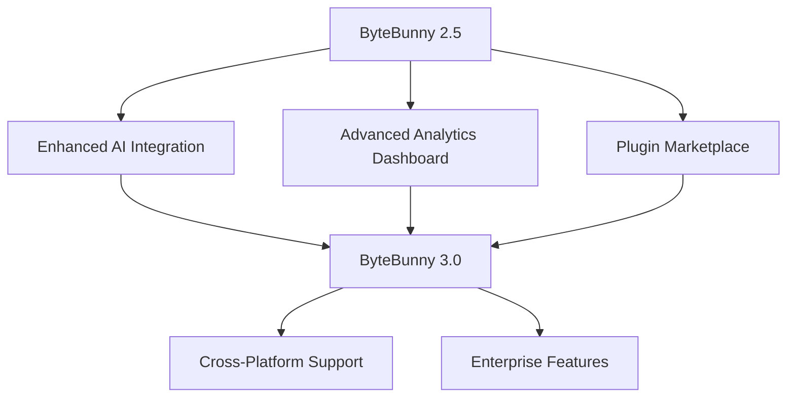

<div align="center">

# 🐰 ByteBunny Discord SelfBot 🤖


<p align="center">
  
  
  
  
</p>

<p align="center">
  
  
  
  
</p>

---

## 🎯 **About ByteBunny**

<table>
<tr>
<td width="50%">

**ByteBunny** is a cutting-edge Discord SelfBot engineered for advanced automation, utility management, and seamless Discord experience enhancement. Built with precision and designed for power users who demand excellence.

### 🚀 **Core Philosophy**
- **Performance First**: Optimized for speed and efficiency
- **Security Minded**: Built with privacy and safety in mind  
- **User Centric**: Intuitive design meets powerful functionality
- **Future Ready**: Continuously evolving with Discord's ecosystem

</td>
<td width="50%">

```python
class ByteBunny:
    def __init__(self):
        self.creator = "driizzyy"
        self.purpose = "Discord Automation Excellence"
        self.features = [
            "Advanced Message Management",
            "Smart Auto-Responses", 
            "Server Utilities",
            "Custom Commands",
            "Privacy Protection"
        ]
        self.status = "Actively Maintained"
```

</td>
</tr>
</table>

---

## ⚡ **Key Features**

<div align="center">

| 🎮 **Automation** | 🛡️ **Security** | 🔧 **Utilities** | 📊 **Analytics** |
|:-----------------:|:----------------:|:-----------------:|:-----------------:|
| Auto-Responder | Token Protection | Message Cleaner | Usage Statistics |
| Reaction Roles | Secure Storage | Embed Builder | Performance Metrics |
| Scheduled Tasks | Encrypted Config | Server Manager | Activity Tracking |
| Smart Commands | Privacy Mode | Custom Triggers | Real-time Monitoring |

</div>

### 🌟 **Advanced Capabilities**

```yaml
ByteBunny Features:
  Core:
    - Multi-Server Management
    - Custom Command Framework
    - Advanced Message Processing
    - Real-time Event Handling
  
  Automation:
    - Smart Auto-Moderation
    - Scheduled Message System
    - Reaction Management
    - Status Rotation
  
  Utilities:
    - Mass Message Operations
    - Server Information Gathering
    - User Activity Tracking
    - Custom Embed Generation
  
  Security:
    - Token Encryption
    - Secure Configuration
    - Privacy Protection
    - Safe Mode Operations
```

---

## 🛠️ **Tech Stack**

<div align="center">


</div>

<table align="center">
<tr>
<td align="center"><strong>Language</strong></td>
<td align="center"><strong>Framework</strong></td>
<td align="center"><strong>Database</strong></td>
<td align="center"><strong>Tools</strong></td>
</tr>
<tr>
<td align="center">Python 3.9+</td>
<td align="center">discord.py-self</td>
<td align="center">SQLite3</td>
<td align="center">Git, VSCode</td>
</tr>
</table>

---

## 📈 **GitHub Analytics**

<div align="center">


</div>

<div align="center">


</div>

---

## 🎨 **Project Showcase**

<div align="center">

<a href="https://github.com/driizzyy/ByteBunny-SelfBot">
  
</a>

</div>

### 🏆 **Repository Highlights**

- **🐰 ByteBunny-SelfBot**: Advanced Discord automation suite
- **⚙️ ByteBunny-Config**: Configuration management system  
- **🔌 ByteBunny-Plugins**: Extensible plugin ecosystem
- **📚 ByteBunny-Docs**: Comprehensive documentation

---

## 🎯 **Activity & Contributions**

<div align="center">


</div>

---

## 🤝 **Connect & Collaborate**

<div align="center">

<p align="center">
  <a href="https://discord.gg/bytebunny"></a>
  <a href="https://github.com/driizzyy"></a>
  <a href="mailto:contact@bytebunny.dev"></a>
</p>

### 💎 **Support ByteBunny**

<p align="center">
  <a href="https://ko-fi.com/driizzyy"></a>
  <a href="https://patreon.com/driizzyy"></a>
</p>

</div>

---

## 📊 **Detailed Statistics**

<div align="center">

<table>
<tr>
<td align="center">

**🔥 Contribution Stats**
<br>


</td>
</tr>
<tr>
<td align="center">

**⏰ Productive Hours**
<br>


</td>
</tr>
</table>

</div>

---

## 🏅 **Achievements & Trophies**

<div align="center">


</div>

---

## 🌈 **Profile Views & Visitors**

<div align="center">


</div>

---

## 📜 **Code Philosophy**

<div align="center">


</div>

### 🎨 **Development Principles**

```javascript
const byteBunnyPrinciples = {
    codeQuality: "Clean, maintainable, and well-documented",
    userExperience: "Intuitive design meets powerful functionality", 
    performance: "Optimized for speed and efficiency",
    security: "Privacy and safety are non-negotiable",
    community: "Built with and for the Discord community",
    innovation: "Pushing the boundaries of what's possible"
};
```

---

## 🔮 **What's Next?**

<div align="center">



</div>

---

<div align="center">

## 🎵 **Current Vibe**


---

### 🚀 **"Building the future of Discord automation, one commit at a time"**


---

<p align="center">
  
</p>

</div>